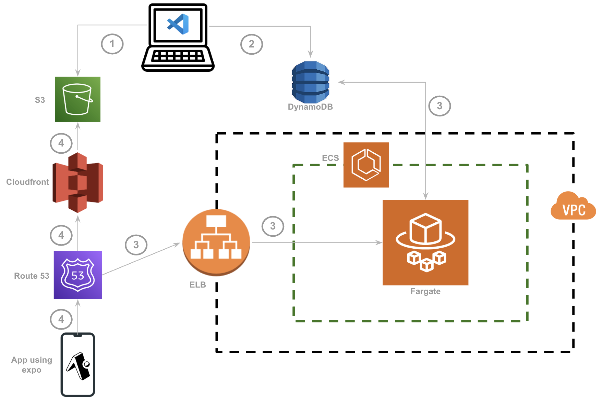

<div style="display: flex; align-items: center; justify-content: center; gap: 20px;">
   + 
</div>

## Serverless Expo OTA server

A custom serverless implementation of Expo Over-The-Air (OTA) updates server. Built with Nest.js and TypeScript. It can be used as a cost effective way to manage your app's OTA update distribution.

## Why serverless?

1. An OTA server is a low-traffic server that only needs to serve a few requests per day. A serverless implementation is a cost effective way to manage your app's OTA update distribution, while also handling traffic spikes efficiently.

2. An example of an OTA server implementation (https://github.com/expo/custom-expo-updates-server) stores bundle and asset files on the server disk and read from it every time a GET /api/manifest request or a GET /api/assets request is made. This makes the solution not suitable for horizontally scalable deployments.

3. https://github.com/xavia-io/xavia-ota provides a workaround by persisting files on a blob storage service. But still, with every GET /api/manifest request made to the server from the client, the server downloads these files from the blob storage service to the disk, reads them and generates the manifest JSON on runtime. This increases the latency of the GET /api/manifest request. Asset caching benefits from cloudfront CDN are also not available.

4. So, to summarize, the serverless implementation

- is cost effective- you only pay for the compute time
- is horizontally scalable
- reduces the latency of the GET /api/manifest request (no need to download files to disk for every request)
- provides asset caching benefits from cloudfront CDN

## Architecture



1. On the client codebase, the Expo CLI is used to generate .hbc bundles and assets. These bundles and seets represent the codebase changeset that will later be distributed to the users via over-the-air updates. The generated bundles and assets are uploaded to a s3 bucket. Along with this, a manifest JSON file is also generated. This files contains the metadata of the update, such as the id, createdAt, launchAsset URL, etc. The launchAsset URL directly points to the location of the bundles and assets in the s3 bucket.

2. A new entry is added to a dynamoDB table. The partition key of the entry is a composite value consisting of the target platform and the target runtime version of the ota updates, something like `android-1.0.0`. The sort key is the update number for the given runtime version, something like `1` or `2`. A stringified manifest is stored in the `manifest` attribute. This way, the server can directly read the manifest from the database using a dynamoDB Query operation, rather than having to read the manifest file from a s3 bucket.

<div style="overflow-x: auto;">

| Partition Key | Sort Key | id                       | platform | manifest | mandatory | runtimeVersion | otaUpdateVersion | activeDevices | enabled | createdAt  | updatedAt  |
| ------------- | -------- | ------------------------ | -------- | -------- | --------- | -------------- | ---------------- | ------------- | ------- | ---------- | ---------- |
| android-1.0.0 | 1        | fsfs133-14fdgds-13424dbg | android  | {...}    | true      | 1.0.0          | 1                | 100           | true    | 2025-01-01 | 2025-01-01 |
| android-1.0.0 | 2        | fsfs133-14fdgds-13424dbg | android  | {...}    | true      | 1.0.0          | 2                | 1240          | true    | 2025-01-01 | 2025-01-01 |

</div>

3. The client app queries the GET /api/manifest endpoint on the server. The server makes a Query operation on the dynamoDB table for the manifest JSON using the partition key and sort key, and returns the manifest JSON to the client.

4. If there is a new update available, the client app fetches bundles and assets from the cloudfront distribution pointing to the s3 bucket, without making any additional requests to the server.

## Prerequisites

1. Create a s3 bucket and a cloudfront distribution that points to the s3 bucket.

2. Create a dynamoDB table.

## Project setup

1. Install dependencies:

```bash
yarn install
```

2. Create a `.env` file in the root directory

```bash
cp .env.example .env
```

Configure the necessary variables in the `.env` file.

3. Run the project on local

```bash
yarn start
```

## Client side OTA updates

1. Setup expo-modules and install expo-updates in the client codebase.

2. Generate a docker image of the server and upload it to AWS Elastic Container Registry. First, make sure you have the AWS CLI installed and configured. Also, update the `ECR_REPOSITORY` variable in the `upload_docker_image.sh` script with the correct value. Then, run the following command:

```bash
$ bash upload_docker_image.sh
```

Run the server on either AWS Lambda or AWS Fargate.

3. On the client codebase, paste the contents of /scripts/client in a folder called otaScripts. If you paste the contents in a different folder, make sure to update the paths in the upload_expo_client_assets.sh script. Also, update the RUNTIME_VERSION, EXPO_UPDATES_SERVER_URL, EXPO_UPDATES_ASSETS_URL variables in the upload_expo_client_assets.sh script. Then, run the following command to upload the bundles and assets to the s3 bucket and the manifest to the dynamoDB table.

```bash
$ bash ./otaScripts/upload_expo_client_assets.sh
```

## Author

- [Adithya Viswamithiran](https://github.com/adithyavis/)

## License

[MIT](./LICENSE)
